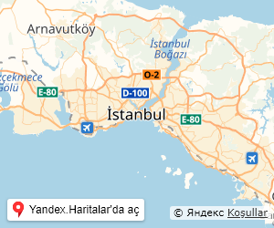
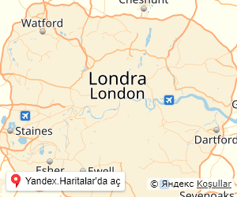
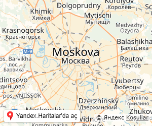

# City Map Preview Image Creator [](https://ci.appveyor.com/project/tufantunc/city-map-preview-image-creator) [](https://david-dm.org/tufantunc/city-map-preview-image-creator)
> Bu örnek uygulama [Yandex Haritalar](https://tech.yandex.com.tr/maps/doc/jsapi/2.1/quick-start/index-docpage/)ı kullanarak şehir harita görünümü görselleri oluşturup kaydeder.

## Amacı
Headless browser, bir GUI yani kullanıcı arabirimi olmadan çalışan tarayıcılara denir. Sıklıkla UI testlerinde ve websiteleri ile yapılan işlerin otomasyonunda kullanılırlar. En popüler örnekleri PhantomJS ve Puppeteer'dır. Bu uygulama ile Google Chrome tarayıcısının headless versiyonu olan Puppeteer'ın örnek kullanımını görebilirsiniz.

## Kullanım
Node Modüllerini yükleyin:
```
npm install
```
Çalıştırmadan önce mapshots klasöründeki görselleri temizlemek isteyebilirsiniz.

Çalıştırmak için:
```
npm start
```
Aşağıdaki gibi bir konsol çıktısı alacaksınız:
```
4/1 - İstanbul image created.
4/2 - London image created.
4/3 - Los Angeles image created.
4/4 - Moskow image created.
```
Mapshots klasörüne giderek oluşturulan imajları görebilirsiniz

App.js dosyasındaki ayarları ve samplecities.json dosyasını düzenleyerek istediğiniz şehrin tercih ettiğiniz boyutlarda harita görselini oluşturabilirsiniz.

## Örnek Harita Görselleri

 

 